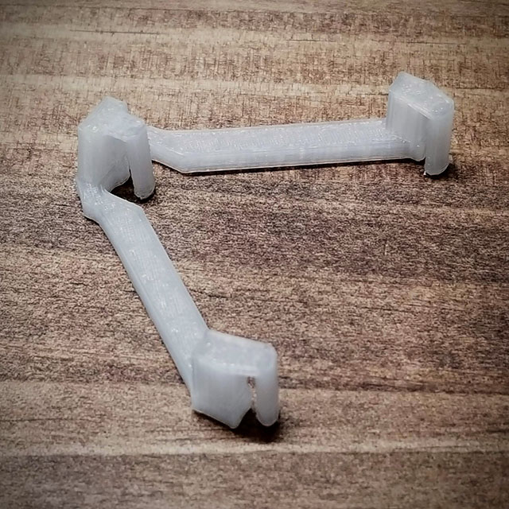

# Glass Mask Anti-Fog

## About
Glasses mask anti-fogging  
マスクの曇り止め  

私が花粉症で、花粉除け眼鏡＋マスクで外出するときに眼鏡曇ってこまるなーという事で作成しました。
設計は適当で、使ってはデータを切った張った(Push､Pull)で作成しています。

### GEN2

### GEN1

The one in the photo was printed in FLASHFORGE Adventurer3.

# Download

## GEN2
- [GlassMaskAntiFg-v1.f3d](https://github.com/mikekoma/GlassMaskAntiFog/GlassMaskAntiFg-GEN2-v1) Autodesk Fusion 360 Archive file
- [GlassMaskAntiFg-v1.obj](https://github.com/mikekoma/GlassMaskAntiFog/GlassMaskAntiFg-GEN2-v1)

## GEN1
- [GlassMaskAntiFg-v1.f3d](https://github.com/mikekoma/GlassMaskAntiFog/GlassMaskAntiFg-v7.f3d) Autodesk Fusion 360 Archive file
- [GlassMaskAntiFg-v1.obj](https://github.com/mikekoma/GlassMaskAntiFog/GlassMaskAntiFg-v7.stl)

# License

This work is licensed under a [Creative Commons Attribution 4.0 International License](http://creativecommons.org/licenses/by/4.0/).  
この作品は[クリエイティブ・コモンズ 表示 4.0 国際 ライセンス](http://creativecommons.org/licenses/by/4.0/)の下に提供されています。  
  
原作者のクレジット（氏名、作品タイトルなど）を表示することを主な条件とし、改変はもちろん、営利目的での二次利用も許可される最も自由度の高いCCライセンス。  
  
[クリエイティブ・コモンズ・ライセンスとは](https://creativecommons.jp/licenses/)  
[https://creativecommons.org/](https://creativecommons.org/)

# Author
Suns & Moon Laboratory  
https://www.s-m-l.org  
[twitter @mikekoma](https://twitter.com/mikekoma)
